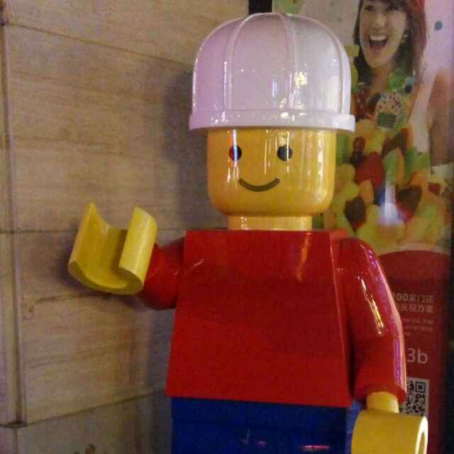
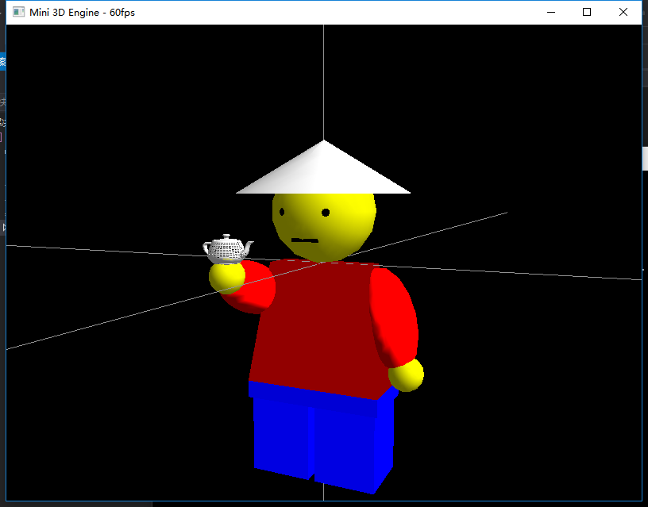
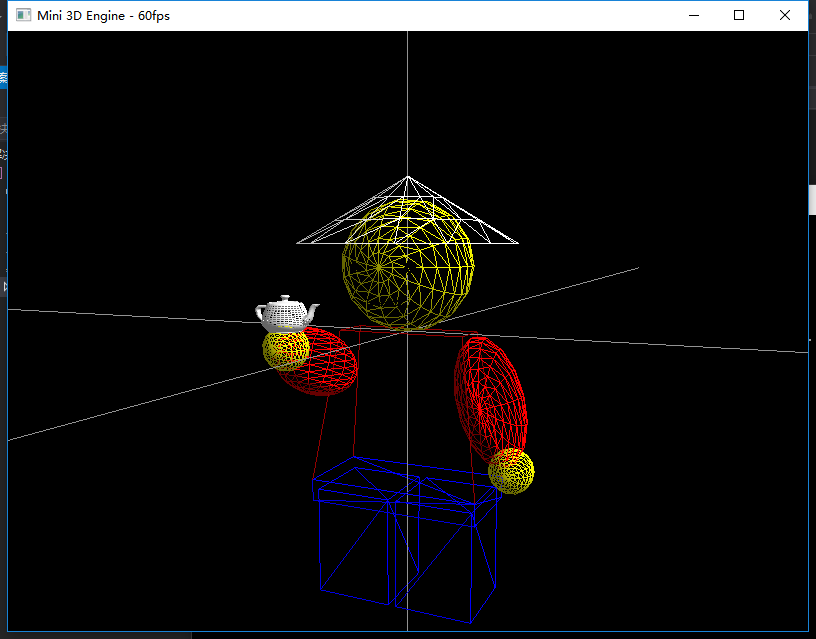

# 三维游戏编程入门 课程设计

## 〇、要求

### 参考 MiniEngine 例程，编写演示程序。

- 提示：修改 draw_scene() 函数。

### 撰写《课程设计报告》

1. 程序的编写目的、分析与思路。
2. 源代码（核心部分）。
3. 运行截图、分析与结论。

## 一、程序分析和思路

通过阅读例程源码，发现了一部分常用的绘图函数，通过查阅 头文件 和 相关资料，总结出 freeglut 常用绘图函数的 使用方法，特此记录下来：

### freeglut 的相关 API：

	// width 为 GLfloat 类型值，在 0.0 ~ 10.0，大于 10 以上按 10 来处理。
	WINGDIAPI void APIENTRY glLineWidth (GLfloat width);

	// RGB 0.0 ~ 1.0 （乘上 255 即为对应的 RGB 值）
	WINGDIAPI void APIENTRY glColor3f (GLfloat red, GLfloat green, GLfloat blue);

	// 表示将当前图形沿x,y,z轴分别放大为原来的 x, y, z 倍
	WINGDIAPI void APIENTRY glScaled (GLdouble x, GLdouble y, GLdouble z);

	// 以点(0,0,0)到点(x,y,z)为轴，旋转angle角度
	WINGDIAPI void APIENTRY glRotatef (GLfloat angle, GLfloat x, GLfloat y, GLfloat z);

	// 平移向量(x,y,z)
	WINGDIAPI void APIENTRY glTranslated (GLdouble x, GLdouble y, GLdouble z);

### freeglut 的相关 FGAPI：

	// 绘制一个（边长为 size）的立方体（线体）
	FGAPI void FGAPIENTRY glutWireCube( double size );
	// 绘制一个（边长为 size）的立方体（实体）
	FGAPI void FGAPIENTRY glutSolidCube( double size );

	// 绘制一个（半径为 radius，围绕z轴分割的数目为 slices，沿着z轴分割的数目为 stacks）的球体（线体）
	FGAPI void FGAPIENTRY glutWireSphere( double radius, GLint slices, GLint stacks );
	// 绘制一个（半径为 radius，围绕z轴分割的数目为 slices，沿着z轴分割的数目为 stacks）的球体（实体）
	FGAPI void FGAPIENTRY glutSolidSphere( double radius, GLint slices, GLint stacks );

	// 绘制一个（底部半径为 base，高度为 height，围绕z轴分割的数目为 slices，沿着z轴分割的数目为 stacks）的锥体（线体）
	FGAPI void FGAPIENTRY glutWireCone( double base, double height, GLint slices, GLint stacks );
	// 绘制一个（底部半径为 base，高度为 height，围绕z轴分割的数目为 slices，沿着z轴分割的数目为 stacks）的锥体（实体）
	FGAPI void FGAPIENTRY glutSolidCone( double base, double height, GLint slices, GLint stacks );

	// 绘制一个（内径为 innerRadius，外径为 outerRadius，围绕z轴分割的数目为 slices，沿着z轴分割的数目为 stacks）的圆环体（线体）
	FGAPI void    FGAPIENTRY glutWireTorus( double innerRadius, double outerRadius, GLint sides, GLint rings );
	// 绘制一个（内径为 innerRadius，外径为 outerRadius，围绕z轴分割的数目为 slices，沿着z轴分割的数目为 stacks）的圆环体（实体）
	FGAPI void FGAPIENTRY glutSolidTorus( double innerRadius, double outerRadius, GLint sides, GLint rings );

	// 绘制一个正十二面体（线体）
	FGAPI void    FGAPIENTRY glutWireDodecahedron( void );
	// 绘制一个正十二面体（固体）
	FGAPI void    FGAPIENTRY glutSolidDodecahedron( void );

	// 绘制一个正八面体（线体）
	FGAPI void    FGAPIENTRY glutWireOctahedron( void );
	// 绘制一个正八面体（固体）
	FGAPI void    FGAPIENTRY glutSolidOctahedron( void );

	// 绘制一个正四面体（线体）
	FGAPI void    FGAPIENTRY glutWireTetrahedron( void );
	// 绘制一个正四面体（固体）
	FGAPI void    FGAPIENTRY glutSolidTetrahedron( void );

	// 绘制一个正二十面体（线体）
	FGAPI void    FGAPIENTRY glutWireIcosahedron( void );
	// 绘制一个正二十面体（固体）
	FGAPI void    FGAPIENTRY glutSolidIcosahedron( void );

	// 绘制一个 茶壶（线体）
	FGAPI void    FGAPIENTRY glutWireTeapot( double size );
	// 绘制一个 茶壶（固体）
	FGAPI void    FGAPIENTRY glutSolidTeapot( double size );

## 二、源代码（核心部分）

本项目Github地址：[https://github.com/gdut-yy/MyMiniEngine](https://github.com/gdut-yy/MyMiniEngine)

	void draw_scene() {
		//draw_obj_model();
		//draw_xmas_tree();
		//draw_helicopter();
		draw_profile_photo();
	}

----

	void draw_profile_photo(){
		print_axis();
		print_head();	// 绘制头部	
		print_body();	// 绘制身体
		print_foot();	// 绘制下身	
	}

----

	void print_axis() {
		// 绘制白色坐标轴
		glColor3f(1.0f, 1.0f, 1.0f);
		glBegin(GL_LINES);
		glVertex3f(-9.0f, 0.0f, 0.0f);
		glVertex3f(9.0f, 0.0f, 0.0f);
		glVertex3f(0.0f, -9.0f, 0.0f);
		glVertex3f(0.0f, 9.0f, 0.0f);
		glVertex3f(0.0f, 0.0f, -9.0f);
		glVertex3f(0.0f, 0.0f, 9.0f);
		glEnd();
	}
	
	void print_head() {
		// 绘制头部
		glPushMatrix();
		glTranslated(0.0f, 0.3f, 0.0f);
		glColor3f(1.0f, 1.0f, 0.0f);	// 黄色
		glutSolidSphere(0.3f, 15, 15);
		glPopMatrix();
	
		// 绘制左眼
		glPushMatrix();
		glTranslated(-0.12f, 0.3f, 0.25f);
		glColor3f(0.0f, 0.0f, 0.0f);	// 黑色
		glutSolidSphere(0.03f, 10, 10);
		glPopMatrix();
	
		// 绘制右眼
		glPushMatrix();
		glTranslated(0.12f, 0.3f, 0.25f);
		glColor3f(0.0f, 0.0f, 0.0f);	// 黑色
		glutSolidSphere(0.03f, 10, 10);
		glPopMatrix();
	
		// 绘制嘴部
		glPushMatrix();
		glTranslated(0.0f, 0.15f, 0.25f);
		glScaled(0.15f, 0.02f, 0.02f);
		glColor3f(0.0f, 0.0f, 0.0f);	// 黑色
		glutSolidCube(1.0f);
		glPopMatrix();
	
		// 绘制帽子
		glPushMatrix();
		glTranslated(0.0f, 0.40f, 0.0f);
		glRotatef(-90, 1, 0, 0);
		glColor3f(1.0f, 1.0f, 1.0f);	// 白色
		glutSolidCone(0.5f, 0.3f, 15, 3);
		glPopMatrix();
	}
	
	void print_body() {
		GLfloat up_x = 0.3;		// 身体顶面 x轴 正负偏离值
		GLfloat up_y = 0.0;		// 身体顶面 y轴 正负偏离值
		GLfloat up_z = 0.1;		// 身体顶面 z轴 正负偏离值
	
		GLfloat down_x = 0.4;	// 身体底面 x轴 正负偏离值
		GLfloat down_y = 0.7;	// 身体底面 y轴 正负偏离值
		GLfloat down_z = 0.2;	// 身体底面 z轴 正负偏离值
	
		glBegin(GL_QUADS);				// 绘制正方形  	
		glColor3f(1.0f, 0.0f, 0.0f);	// 红色
	
		// 身体顶面
		glVertex3f(up_x, up_y, -up_z);	// 右上  
		glVertex3f(-up_x, up_y, -up_z);	// 左上  
		glVertex3f(-up_x, up_y, up_z);	// 左下  
		glVertex3f(up_x, up_y, up_z);	// 右下  
	
		glVertex3f(up_x, up_y, up_z);
		glVertex3f(-up_x, up_y, up_z);
		glVertex3f(-up_x, up_y, -up_z);
		glVertex3f(up_x, up_y, -up_z);
	
		// 身体左面
		glVertex3f(-up_x, up_y, up_z);
		glVertex3f(-up_x, up_y, -up_z);
		glVertex3f(-down_x, -down_y, -down_z);
		glVertex3f(-down_x, -down_y, down_z);
	
		glVertex3f(-down_x, -down_y, down_z);
		glVertex3f(-down_x, -down_y, -down_z);
		glVertex3f(-up_x, up_y, -up_z);
		glVertex3f(-up_x, up_y, up_z);
	
		// 身体右面
		glVertex3f(up_x, up_y, -up_z);
		glVertex3f(up_x, up_y, up_z);
		glVertex3f(down_x, -down_y, down_z);
		glVertex3f(down_x, -down_y, -down_z);
	
		glVertex3f(down_x, -down_y, -down_z);
		glVertex3f(down_x, -down_y, down_z);
		glVertex3f(up_x, up_y, up_z);
		glVertex3f(up_x, up_y, -up_z);
	
		// 身体正面
		glVertex3f(up_x, up_y, up_z);
		glVertex3f(-up_x, up_y, up_z);
		glVertex3f(-down_x, -down_y, down_z);
		glVertex3f(down_x, -down_y, down_z);
	
		glVertex3f(down_x, -down_y, down_z);
		glVertex3f(-down_x, -down_y, down_z);
		glVertex3f(-up_x, up_y, up_z);
		glVertex3f(up_x, up_y, up_z);
	
		// 身体背面
		glVertex3f(-up_x, up_y, -up_z);
		glVertex3f(up_x, up_y, -up_z);
		glVertex3f(down_x, -down_y, -down_z);
		glVertex3f(-down_x, -down_y, -down_z);
	
		glVertex3f(-down_x, -down_y, -down_z);
		glVertex3f(down_x, -down_y, -down_z);
		glVertex3f(up_x, up_y, -up_z);
		glVertex3f(-up_x, up_y, -up_z);
	
		// 身体底面
		glVertex3f(down_x, -down_y, -down_z);	//右上  
		glVertex3f(-down_x, -down_y, -down_z);	//左上  
		glVertex3f(-down_x, -down_y, down_z);	//左下  
		glVertex3f(down_x, -down_y, down_z);	//右下
	
		glVertex3f(down_x, -down_y, down_z);
		glVertex3f(-down_x, -down_y, down_z);
		glVertex3f(-down_x, -down_y, -down_z);
		glVertex3f(down_x, -down_y, -down_z);
	
		glEnd();
	
		// 绘制左手臂
		glPushMatrix();
		glTranslated(-0.4f, -0.15f, 0.15f);
		glRotatef(70, 1, 0, 0);
		glScaled(0.15f, 0.3f, 0.15f);
		glColor3f(1.0f, 0.0f, 0.0f);	// 红色
		glutSolidSphere(1.0f, 15, 15);
		glPopMatrix();
	
		// 绘制左手掌
		glPushMatrix();
		glTranslated(-0.4f, -0.05f, 0.4f);
		glColor3f(1.0f, 1.0f, 0.0f);	// 黄色
		glutSolidSphere(0.1f, 15, 15);
		glPopMatrix();
	
		// 绘制茶壶
		glPushMatrix();
		glTranslated(-0.4f, 0.1f, 0.4f);
		glColor3f(1.0f, 1.0f, 1.0f);	// 白色
		glutWireTeapot(0.1f);
		glPopMatrix();
	
		// 绘制右手臂
		glPushMatrix();
		glTranslated(0.40f, -0.3f, 0.0f);
		glRotatef(15, 0, 0, 1);
		glScaled(0.15f, 0.3f, 0.15f);
		glColor3f(1.0f, 0.0f, 0.0f);	// 红色
		glutSolidSphere(1.0f, 15, 15);
		glPopMatrix();
	
		// 绘制右手掌
		glPushMatrix();
		glTranslated(0.5f, -0.6f, 0.0f);
		glColor3f(1.0f, 1.0f, 0.0f);	// 黄色
		glutSolidSphere(0.1f, 15, 15);
		glPopMatrix();
	}
	
	void print_foot() {
		// 绘制腿部
		glPushMatrix();
		glTranslated(0.0f, -0.75f, 0.0f);
		glScaled(0.8f, 0.1f, 0.4f);
		glColor3f(0.0f, 0.0f, 1.0f);	// 蓝色
		glutSolidCube(1.0f);
		glPopMatrix();
	
		// 绘制左腿
		glPushMatrix();
		glTranslated(-0.2f, -1.0f, 0.0f);
		glScaled(0.36f, 0.5f, 0.36f);
		glColor3f(0.0f, 0.0f, 1.0f);	// 蓝色
		glutSolidCube(1.0f);
		glPopMatrix();
	
		// 绘制右腿
		glPushMatrix();
		glTranslated(0.2f, -1.0f, 0.0f);
		glScaled(0.36f, 0.5f, 0.36f);
		glColor3f(0.0f, 0.0f, 1.0f);	// 蓝色
		glutSolidCube(1.0f);
		glPopMatrix();
	}

## 三、运行截图

项目通过参照本人微信头像，使用 freeglut api 编程绘制出 3D 图像。

## 四、结论&心得

因为学期尾声，考试月等时间原因，本模型从 学习例程、绘制草图 到 最后的编码实现 仅经历了一个下午的时间。由于开发过程比较仓促，还有很多的细节部分需要后续去调整，如灯光投射、动态展示等；还有 半球，圆柱体 的绘制方面，因为 freeglut 并没有 直接提供相关 api，实现起来还是需要想一下办法。

此次课设，本人直接使用 freeglut 的 api 进行绘图，感觉是非常面向过程的，每一个点的坐标都要自己建立坐标系去计算，然后根据实际效果进行调整等。没想到就这样一个简单的模型都要写到上百行代码。后续有时间会学习一下 用于生产环境的建模工具，如 3DS MAX，MAYA 等，以及 计算机图形学的相关知识。

最后，值得一提的是，老师是个好老师。从他的 Qt GUI开发、Android入门、到这次的 三维游戏编程入门 课程，作为一个计算机学院的学生，在他的课堂上也学到了很多 实用的知识，开拓了视野。虽然由于选修的课时原因，老师并没有讲得太深入，但也很好地为我们指了一条路，去自学。谢谢~

本项目Github地址：[https://github.com/gdut-yy/MyMiniEngine](https://github.com/gdut-yy/MyMiniEngine)

